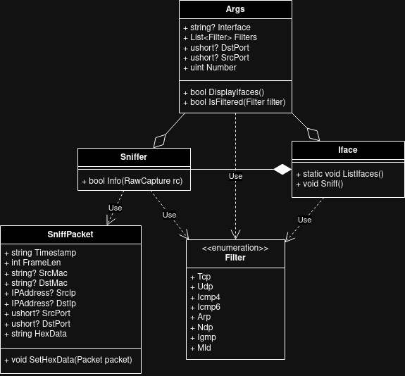

# IPK project 2 - ZETA

## Table of Contents
- [Project summary](#project-summary)
- [PCAP library](#pcap-library)
    - [Sniffed packet info](#sniffed-packet-info)
- [Code overview:](#code-overview)
    - [Class diagram](#class-diagram)
    - [Args](#args)
    - [Iface](#iface)
    - [Sniffer](#sniffer)
    - [SniffPacket](#sniffpacket)
    - [Filter](#filter)
- [Testing](#testing)
- [Bibliography](#bibliography)

## Project summary
This project implements packet sniffer in the terminal. Its basically Wireshark
in the terminal, but with less features.

User is able to filter packets based on the used protocol and based on source
and destination port (if packet uses ports).

It is also possible to set number of packets to sniff/catch before quitting
sniffing for next packets.

## PCAP library
Since I implement the project in C#, I used SharpPCAP library, which is very
simple to use. I need to open the interface, which user select, and then
assign function to `onPacketArrival` handler. This function ten parses the
received packet, which is then parsed using PacketDotnet library, which is part
of the SharpPCAP library. More detailed description of the implementation is
in [code overview](#code-overview).

### Sniffed packet info
When packet is sniffed and is supposed to be sniffed based on the filters,
multiple info is printed to the console about the packet - timestamp, source
and destination MAC addresses (if packet uses those), frame length in bytes,
source and destination IP addresses (if packet uses those), source and
destination ports (if packet uses those) and the data represented in hex.

## Code overview:

### Class diagram


Class diagram above shows my code layout, which I will now describe class by
class.

### Args
Class for parsing arguments, which also contains functions for checking whether
interfaces should be displayed and if given Filter item should be displayed or
ignored.

### Iface
Class handling basic interface work. It contains static function for listing
all available interfaces and then `Sniff` function to sniff packets on given
interface. When starting sniffing, filter is set based on given filters in
args. On packet arrival, `Info` function on [`Sniffer`](#sniffer) is called.

### Sniffer
Class which handles packet sniffing itself. When function `Info` is called, it
receives `RawCapture` containing the sniffed packet details. The details are
then parsed and stored inside of [`SniffPacket`](#sniffpacket). MLD and NDP
packets are then checked if they're supposed to be printed, since SharpPCAP
doesn't contain filter options for them. After the parsing is done, the
[`SniffPacket`](#sniffpacket) object is printed.

### SniffPacket
Contains the packet details which are then printed. It also contains function
to convert datetime to the required format and data to the hex representation.

### Filter
Enumeration which helps handling filters. It contains options for all supported
filter type.

## Testing
I created basic Python script, that starts the `ipk-sniffer` binary with
some arguments and then sends packet. Output of the sniffer is then checked,
whether it contains expected values.

I also send a different protocol type packet in order to check whether
packet filtering works.

The script name is `test.py` and can be seen in `tests` folder. To run the
script, you will need to have `python3` installed as well as python package
`scapy`. To run the scipt, you need `sudo` privileges
(`sudo python3 test.py` - expects you're in `tests` folder, otherwise you will
need to change the binary path inside of the script)

The scripts sniffs packets on `lo` interface.

This is the output of the script:
```
UDP test
.
Sent 1 packets.
.
Sent 1 packets.
Success

UDP IPv6 test
.
Sent 1 packets.
.
Sent 1 packets.
Success

TCP test
.
Sent 1 packets.
.
Sent 1 packets.
Success

TCP IPv6 test
.
Sent 1 packets.
.
Sent 1 packets.
Success

ICMP test
.
Sent 1 packets.
.
Sent 1 packets.
Success

ICMP6 test
.
Sent 1 packets.
.
Sent 1 packets.
Success

ARP test
.
Sent 1 packets.
.
Sent 1 packets.
Success

NDP test
.
Sent 1 packets.
.
Sent 1 packets.
Success

NDP rs test
.
Sent 1 packets.
.
Sent 1 packets.
Success

MLD test
.
Sent 1 packets.
.
Sent 1 packets.
Success
```

## Bibliography
- Library https://github.com/dotpcap/sharppcap
- RFC 792 - Internet Control Message Protocol a RFC 4443 - ICMPv6
- RFC 826 - ARP
- RFC 5952 - A Recommendation for IPv6 Address Text Representation
- RFC 3339 - Date and Time on the Internet: Timestamps
- Wikipedia, the free encyclopedia: http://en.wikipedia.org/wiki/Pcap
